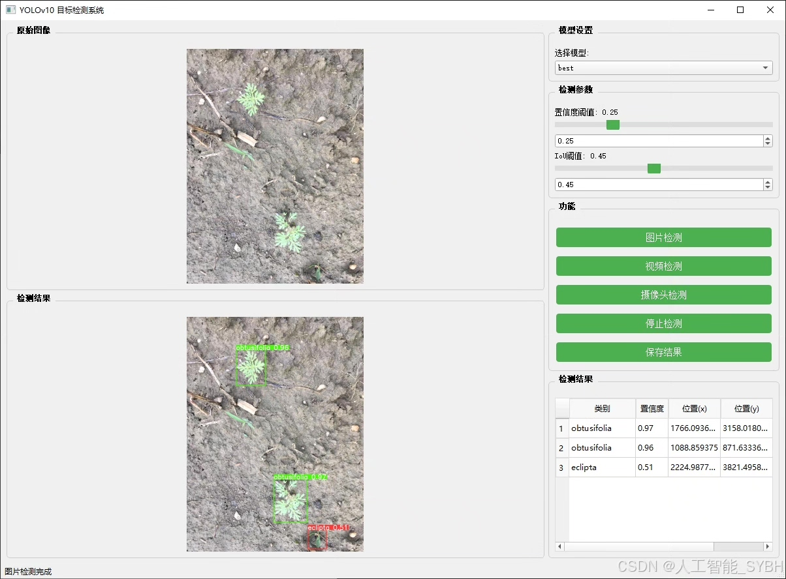
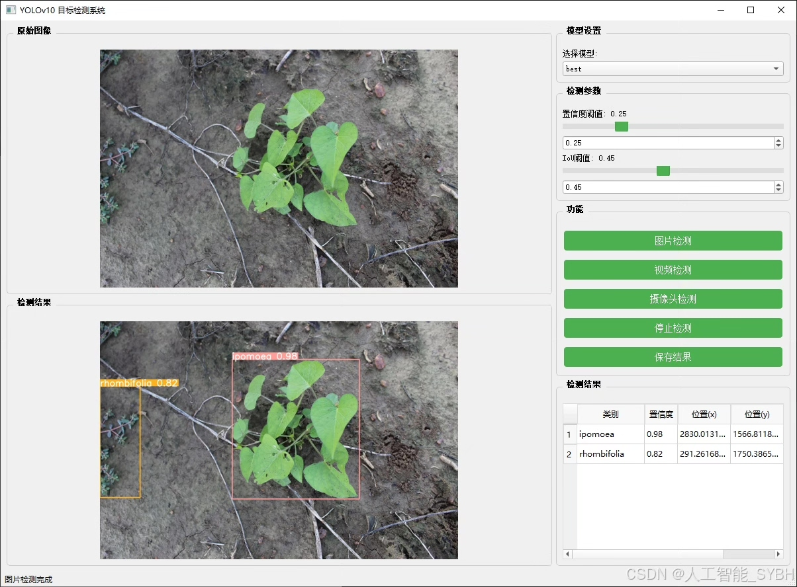
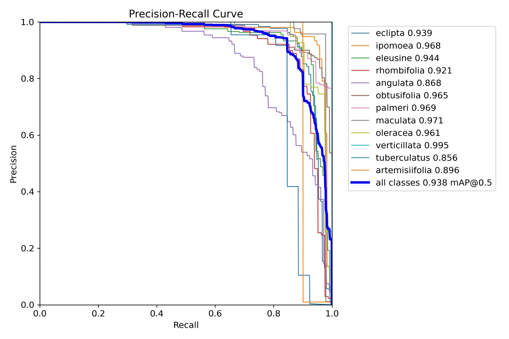
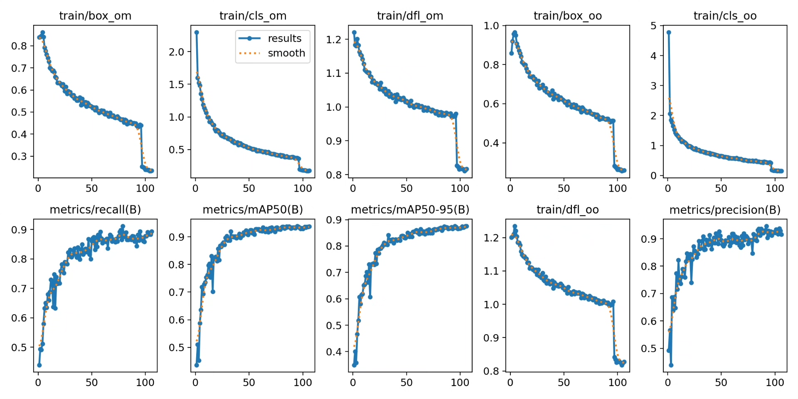
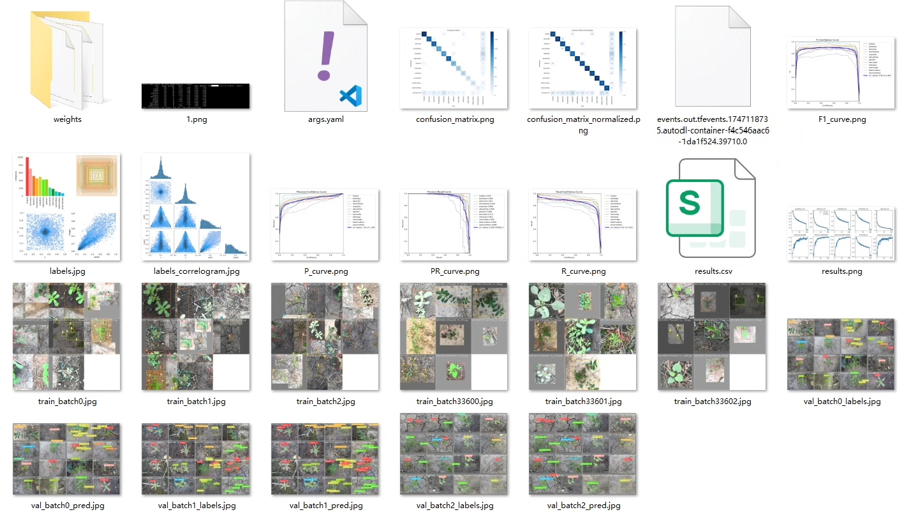
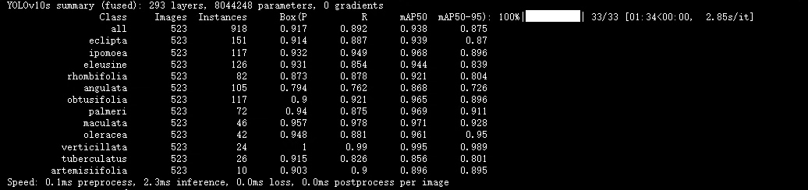
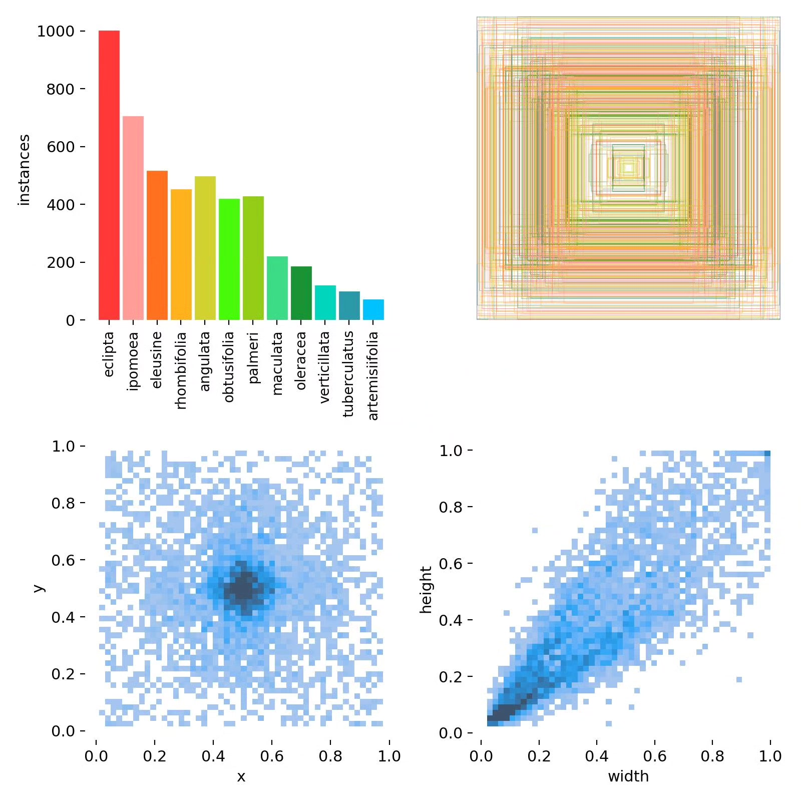
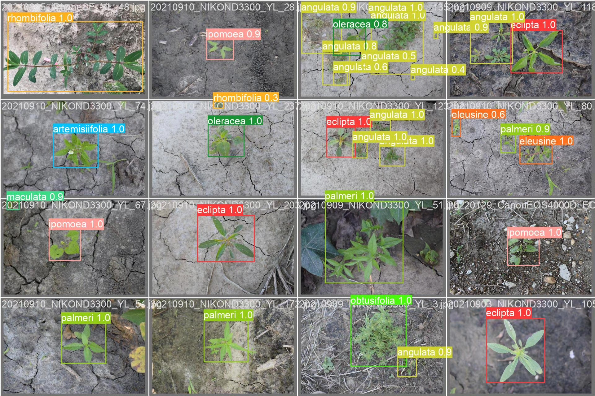

# Based on deep learning YOLOv10 for weed detection system (12 types)

## Body

Based on the YOLOv10 object detection algorithm, this project has developed an efficient weed identification system. It is specifically designed to detect and classify 12 common weed species. The system achieves precise identification of farmland weeds through deep learning technology, providing technical support for precision agriculture and intelligent weed control. The project uses a dataset containing 3319 labeled images (2796 training images, 523 validation images) for model training and validation, achieving high-precision detection of 'eclipta', 'ipomoea', 'eleusine' and other 12 weed species. This system can be widely applied in agricultural production, ecological research, and weed control fields, with significant practical value and scientific research significance.

The company's products have obtained YOLO official commercial license certification.

We provide after-sales service.

After payment, a WeChat account will be provided, which can answer questions anytime.

Environmental configuration: A tutorial on environmental configuration will be provided, and WeChat will provide answers.

Remote installation service: If you need remote configuration, an additional fee of 69 is required,

Configuration failure will result in all fees being refunded (only installation fee refunded for special old computers).

Retraining dataset: After configuring the environment, you can train on your own computer.
If you need us to retrain, just pay 69 + computing power fee (2.5 yuan/hour)

## Images

## Payment

Here is a pay link on Stripe ( https://buy.stripe.com/3cs8yP7sY87d0vu9AB ). Please contact me lonlonago@foxmail.com after funding $89, and I will send you a complete data files , thank you!

